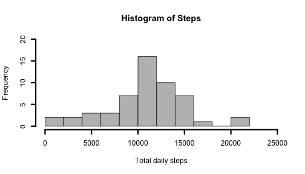
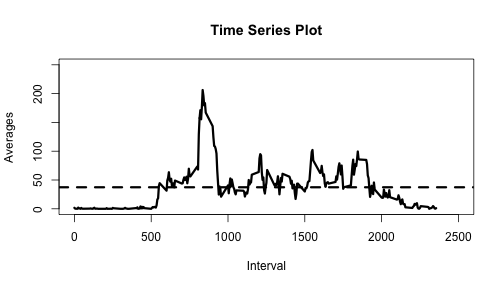
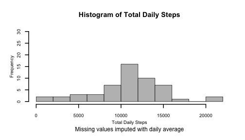
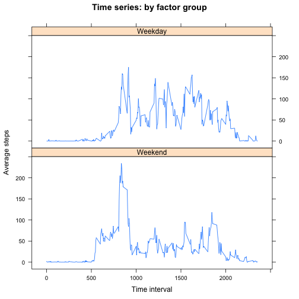

### Reproducible Research Project #1
## Produced by: Kyle Billings

For the first part of this project we need to simply load in the data as 
provided by the course


```r
dat <- read.csv("./activity.csv", header=TRUE, stringsAsFactors=FALSE, sep=",")
```

```
## Warning in file(file, "rt"): cannot open file './activity.csv': No such
## file or directory
```

```
## Error in file(file, "rt"): cannot open the connection
```


After the data was loaded we needed to fix some independent variable. 
A timestamp variable was generated, as well as a date time stamp. These will
be used later in the assingment.


```r
dat$Date <- as.Date(strptime(dat$date, format="%Y-%m-%d"))

dat$datetimestamp <- as.character(strptime(sprintf("%s %04d", dat$date, 
                        dat$interval), format = "%F %H%M", tz = "GMT"))

dat$timestamp <- gsub("^.*? ","",dat$datetimestamp)
```


### What is mean total number of steps taken per day?

First to find the mean number of steps per day and generate a histogram 
of the total number of steps taken per day.


```r
daily.steps <- as.data.frame(aggregate(steps~Date, data=dat, FUN="sum",
                                na.action=na.omit))

colnames(daily.steps)[2] <- "Totals"

hist(daily.steps$Totals, main="Histogram of Steps", xlab="Total daily steps",
     breaks=15, col="gray", lwd=3, xlim=c(0,25000), ylim=c(0,20))
```

 

```r
daily.mean <- mean(daily.steps$Totals)
daily.median <- median(daily.steps$Totals)
```

The daily step average (ignoring the missing values) is  10766.188679. 
The daily step median (ignoring the missing values) is  10765

### What is the average daily activity pattern?

Make a time series plot of the 5-minute average number of steps taken averaged
across all days.


```r
avg.steps <- as.data.frame(aggregate( steps ~ interval, data=dat, FUN="mean"))
colnames(avg.steps)[2] <- "Averages"
plot(x=avg.steps$interval, y=avg.steps$Averages, type="l" , lwd=3, 
        main="Time Series Plot", xlab="Interval", ylab="Averages", 
        xlim=c(0,2500), ylim=c(0,250))
abline(h=mean(mean(avg.steps$Averages)), lty=2,lwd=3)
```

 

```r
avg.steps.temp <- avg.steps[which(avg.steps$Averages==max(avg.steps$Averages)), 
                            c(1,2)]

temp <- dat[which(dat$interval==avg.steps.temp$interval), c(3,5)]


max.avg.steps <- cbind(temp[1,], round(avg.steps.temp$Averages,2))
colnames(max.avg.steps)[3] <- "average"
max.avg.steps$timestamp <- gsub("^.*? ","",max.avg.steps$datetimestamp)


max.int <- max.avg.steps[1,1]
max.avg <- max.avg.steps[1,3]
max.time <- max.avg.steps[1,4]
```
The maximum average number of steps occured in interval:835 and 
the count was 206.17 steps taken at 08:35:00 in the morning.

### Imputing missing values

We have noticed that there appears to be missing values in the data set. The 
first thing is to count the number of missing values. Then we will use the 
daily max to imput those values.


```r
missing <- sum(is.na(dat[,1]))
```

There are 2304 values in the data set. Now the missing values will 
be imputed with the daily averages and a histogram will be generated.


```r
timestamp <- dat[c(3,4,5)]

merge <- merge(avg.steps, timestamp, by="interval")

dat.mod <- merge(dat, merge, by="datetimestamp")

for (i in 1:length(dat[,2])) {
        if (is.na(dat[i,2])) {
                dat[i,2] <- dat[i,10]
        }
}

total.steps <- as.data.frame(aggregate
                             ( steps ~ date, data = dat.mod, FUN="sum"))

colnames(total.steps)[2] <- "Totals" 

par(cex.axis=0.8, cex.lab=0.8, mgp=c(2,1,0))
hist(total.steps$Totals, main="",xlab="Total Daily Steps", breaks=15, col="gray",
     ylim=c(0,30), lwd=2)
title("Histogram of Total Daily Steps", 
        sub="Missing values imputed with daily average", outer=FALSE)
```

 

```r
total.mean <- mean(total.steps$Totals)
total.median <- median(total.steps$Totals)
```
Note that the mean is now 10766.188679 and the median is 10765 
after imputing and recall before imputing the mean and the median were 
10766.188679 and 10765 respectivally. Note that the histogram 
has not changed much. This is mostly likely due to the fact that with a data
set like this we are seeing the effects of weak law of large numbers.

### Are there differences in activity patterns between weekdays and weekends?

For this part we are to generate a new factor variable with two levels -
weekdays and weekend. Then we are to make a panel plot similiar to what we
did previously, only this time by factor group.

 


